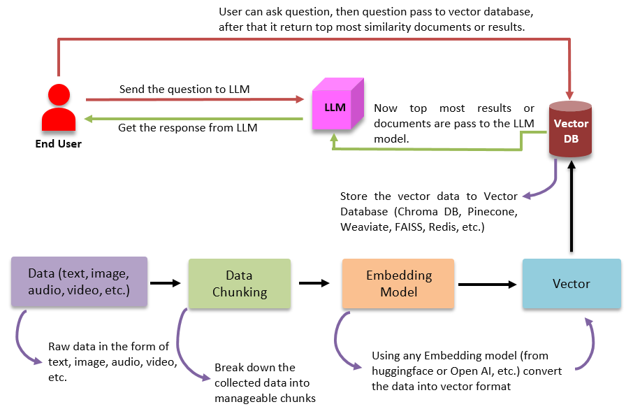
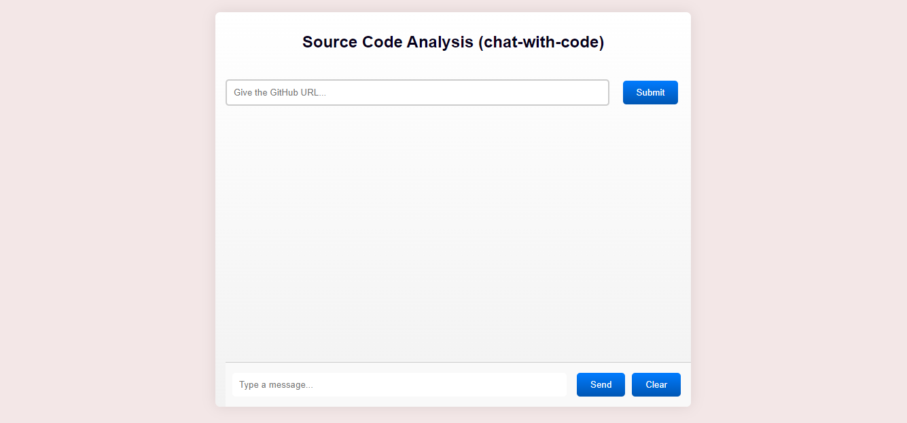

# Chat with Code:
"ChatWithCode" is a project designed to interact with source code through a conversational interface, typically leveraging a chatbot. The goal of this project is to simplify code analysis, comprehension, and possibly modification or debugging through a chat-based system.

## Project Flow:

 

## Web-Interface:
